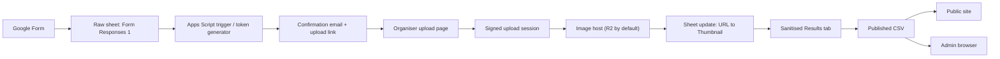

# Image Upload Flow

## Decision

Do not use Google Forms file upload for event thumbnails.

Keep the existing Google Form for event details, then send organisers to a
separate image upload flow that stores the final image on a real public asset
host and writes the resulting public URL back into the sheet.

Use Cloudflare R2 as the default image host.

Keep Cloudinary as the simplest alternative if the team decides that lower
custom build effort matters more than minimising vendor usage.

## Why This Design

- It preserves the current static site contract: the site already expects a
  plain public image URL in `URL to Thumbnail`.
- It avoids forcing organisers to sign in with Google just to upload an image.
- It avoids treating Google Drive as a public asset CDN.
- It keeps the Google Sheet as the single source of truth for event data.
- It gives the festival team a cleaner moderation and support path than email
  attachments or manually pasted Drive links.

## Final Architecture

## Core User Journey

### Organiser flow

1. The organiser submits the normal Google Form with all event details except
   the image file.
2. A stable `Entry ID` is assigned to that row if it does not already exist.
3. The organiser receives a confirmation email that includes an `Upload image`
   link for that event.
4. The organiser opens the upload page, picks an image, previews it, and
   confirms the upload.
5. The uploader stores the image on the public asset host.
6. The upload flow writes the final public URL into `URL to Thumbnail` for the
   matching row.
7. The existing sanitised tab includes that URL in the published CSV.
8. The public site renders the new image automatically on the next fetch.

### Internal team flow

- Leaders continue using the existing admin browser to review entries.
- If an event has no image yet, the admin page can show `No image uploaded`.
- If needed later, the leader editor can expose a `Replace image` action that
  reuses the same upload flow.

## Product Shape

### 1. Google Form

Keep the current `URL to Thumbnail` field in the data model, but do not rely on
organisers to paste a public URL manually.

The form should:

- collect all non-image event data
- keep response editing enabled
- collect organiser email addresses
- send a confirmation email

Optional:

- remove the organiser-facing thumbnail URL question from the public form once
  the separate upload flow exists
- or leave it hidden from most users and reserve it for staff use only

### 2. Upload link generation

After each form submission, Apps Script should generate an upload link using:

- `Entry ID`
- a random upload token
- an expiry timestamp if you want links to expire

Recommended URL shape:

`https://script.google.com/.../exec?mode=upload&id=<ENTRY_ID>&token=<TOKEN>`

The upload token should be stored in the raw sheet or a separate internal tab,
not published in the sanitised tab.

### 3. Upload page

Build a small organiser-facing web app in Apps Script.

Responsibilities:

- validate the `Entry ID` and token
- show the event name and organisation for confirmation
- accept one image file
- validate file type and size before upload
- optionally resize/compress the image client-side
- upload to the image host
- update the matching sheet row with the final URL and audit fields

Recommended validation rules:

- allowed types: `image/jpeg`, `image/png`, `image/webp`
- max file size before processing: `10 MB`
- target output: JPEG or WebP
- target display size: around `1600 px` wide max

### 4. Image host

Default target: Cloudflare R2 public bucket on a custom image domain.

Recommended object key pattern:

`events/<ENTRY_ID>/thumb-<VERSION>.jpg`

Example public URL:

`https://images.sydneygamesfestival.com/events/<ENTRY_ID>/thumb-1721548800.jpg`

Versioned filenames matter because they avoid stale CDN caches when an organiser
replaces an image.

### 5. Sheet update

On successful upload, write these values back to the raw sheet row:

- `URL to Thumbnail` = final public URL
- `Last Updated At` = current timestamp
- `Last Updated By` = organiser email if known, otherwise `organiser-upload`
- `Last Update Source` = `organiser-image-upload`

Recommended additional columns:

- `Thumbnail Status`
- `Thumbnail Path`
- `Thumbnail Uploaded At`
- `Thumbnail Notes`

These are optional, but they make support and moderation easier.

## Required Data Assumptions

This design assumes the raw sheet already has the stable `Entry ID` described in
[Leader-Editor-Design.md](/Users/ryan/Projects/SGF/sgf-schedule/Leader-Editor-Design.md).

At minimum, the upload flow needs:

- one row per event
- one immutable `Entry ID`
- one organiser email address
- one writable `URL to Thumbnail` column

## Security Model

### Goals

- organisers should not need a Google account to upload an image
- upload links should only update one event
- public image URLs should be readable by the site without authentication

### Recommended controls

- each upload link contains a high-entropy token
- the token is bound to exactly one `Entry ID`
- tokens can be single-use or reusable until expiry
- only image MIME types are accepted
- file size and dimensions are enforced
- uploads overwrite by writing a new versioned object path, not by mutating the
  old URL in place

### Non-goals

- hard identity proof beyond possession of the organiser's email inbox
- private image hosting
- granular media library workflows

For this use case, possession of the emailed upload link is a reasonable level
of proof.

## R2-Specific Notes

Use R2 if the team wants the cleanest static-file model.

Recommended setup:

- bucket: `sgf-event-images`
- access: public via custom domain, not the development `r2.dev` URL
- public domain: `images.sydneygamesfestival.com`
- object path prefix: `events/`

Server-side responsibilities:

- create a short-lived signed upload session or receive the file through the web
  app and upload server-side
- return the final public URL
- write that URL to the sheet

Prefer versioned object names over in-place overwrite.

## Cloudinary Variant

Use Cloudinary if the team wants the easiest organiser-facing upload page and is
comfortable with a more image-platform-specific setup.

In that version:

- the upload page sends the file to Cloudinary
- Cloudinary returns a delivery URL
- the flow writes that delivery URL into `URL to Thumbnail`
- optional transformations can standardise size and format automatically

Everything else in this design stays the same.

## Failure Handling

The upload page should show clear organiser-facing errors for:

- invalid or expired upload link
- event not found
- unsupported file type
- file too large
- upload failed
- sheet update failed after a successful upload

If the asset upload succeeds but the sheet update fails:

- keep the uploaded file
- log the failure
- show a support message with the `Entry ID`
- allow the team to repair the row manually

## Implementation Sequence

### Phase 1: minimum viable flow

1. Ensure every row gets a stable `Entry ID`.
2. Create the upload token store.
3. Build the Apps Script upload page.
4. Wire the upload page to R2.
5. Write the final public URL back to the sheet.
6. Send the upload link in the confirmation email.

### Phase 2: operational polish

1. Add client-side image resizing/compression.
2. Add `Replace image` support.
3. Add thumbnail audit columns.
4. Show image status in the admin UI.
5. Add staff-only resend-upload-link tooling.

## What This Does Not Require

- changes to the public site rendering logic
- a backend inside this GitHub Pages repo
- storing binary image files in the sheet
- exposing contact data in the public CSV

The current site already renders a public URL directly, so the upload flow only
needs to make sure a stable public URL lands in the sheet.

## Recommendation

Build the separate organiser upload flow and treat image handling as an asset
pipeline, not a form field.

Use:

`Google Form -> Apps Script upload link -> R2 -> URL to Thumbnail -> Sanitised Results -> Published CSV -> Site`

That path best matches the existing architecture of this repo while keeping
costs low and avoiding the weaknesses of Google Forms file upload and public
Drive links.
