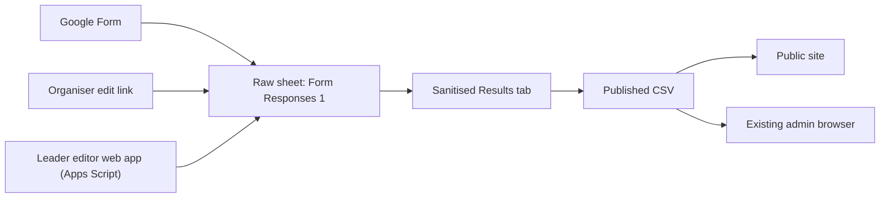

# Leader Editor Design

## Decision

Use a hybrid editing model:

- external organisers edit their own submission through the original Google
  Form edit link
- festival leaders edit any event through a separate leader-only editor served
  by Google Apps Script

Do not use AppSheet for the leader workflow unless the team later decides that
avoiding custom build work is worth the ongoing seat cost.

## Why This Design

- It keeps the Google Sheet as the single source of truth.
- It avoids AppSheet license costs for a small internal team.
- It avoids trying to bolt authenticated write access onto a GitHub Pages site.
- It lets leaders edit any event without needing the original organiser edit
  link.
- It preserves the current static public site and current published CSV flow.

## Final Architecture

## Core Product Shape

### Existing Admin Site

Keep the current admin site as the browse, filter, and triage tool.

- Leaders use [private/admin.html](/Users/ryan/Projects/SGF/sgf-schedule/private/admin.html)
  to find an event.
- The event drawer gets a new `Edit event` button.
- That button opens the leader editor in a new tab using the event's stable
  `Entry ID`.

### New Leader Editor

Build a separate leader-only web app in Apps Script.

- URL shape: `https://script.google.com/.../exec?id=<ENTRY_ID>`
- Purpose: edit one event at a time
- Auth: logged-in Google accounts on an allowlist
- Runtime: Apps Script web app, deployed from a script bound to the response
  spreadsheet

This editor should not replace the current admin browser. It is the write
surface, not the discovery surface.

## Required Sheet Changes

Add these columns to the raw responses sheet if they do not already exist:

- `Entry ID`
- `Last Updated At`
- `Last Updated By`
- `Last Update Source`

### Entry ID Rules

- `Entry ID` is an immutable UUID-like value.
- Every existing row is backfilled once.
- Every new form submission gets an `Entry ID` when the row is first created.
- Organiser edits via the Google Form edit link update the same row and keep the
  same `Entry ID`.

### Audit Rules

On every leader save:

- `Last Updated At` = current timestamp
- `Last Updated By` = leader email
- `Last Update Source` = `leader-editor`

Do not depend on `onEdit` triggers for leader saves or AppSheet-style writes.

## Sanitised Tab Changes

The `Sanitised Results` tab should continue to be formula-driven from the raw
responses sheet, but it must now include `Entry ID` as a published field.

That gives the current site a stable identifier without exposing contact data.

The sanitised tab should still exclude the contact columns:

- `Name`
- `Email Address`
- `Mobile number`
- `Discord handle`
- `Alternate Contact Method`

## Authentication And Access

Deploy the Apps Script web app with:

- access: `ANYONE` so any logged-in Google account can reach the app
- execution: `USER_ACCESSING`

Then enforce an explicit email allowlist in script code.

This is the recommended default because it works whether the 2-5 leaders use a
shared Google Workspace domain or a mix of personal Google accounts. If every
leader is definitely inside one Workspace domain, the access setting can later
be narrowed to `DOMAIN`.

Recommended config:

- `ALLOWED_LEADER_EMAILS = ["leader1@example.com", "leader2@example.com"]`

Why this exact setup:

- each leader authorises with their own Google account
- writes are attributable to the actual person who saved
- the editor can safely stamp `Last Updated By`
- leaders can be added or removed without changing the public site

Leaders should also have direct edit access to the underlying spreadsheet.

## Data Contract

The leader editor loads and saves against `Entry ID`, not row number and not
timestamp.

Server-side editable payload:

- event name
- organisation
- role
- organisation URL
- reach
- co-organisers
- description
- blurb
- status / stage of planning
- published flag
- specific date
- tentative day-slot grid
- other date text
- start time
- end time
- duration
- location
- attendance
- max capacity
- game types
- audience types
- ticket/info URL
- thumbnail URL

Server-side read-only payload:

- contact details
- original submission timestamp
- current `Entry ID`
- current audit fields

Contact details should be shown in a read-only panel for leaders, not mixed into
the editable form fields.

## Concurrency And Conflict Handling

Do not trust "last save wins" silently.

Use optimistic locking based on an `etag` derived from the editable fields in
the current sheet row.

### Load

When the editor opens:

- read the current row by `Entry ID`
- build a canonical editable object
- compute an `etag` from that object
- return both the object and the `etag`

### Save

When the leader clicks save:

- client sends `Entry ID`, edited values, and the original `etag`
- server reloads the current row
- server recomputes the current `etag`
- if the `etag` changed, reject the save and tell the user to reload

This catches collisions from:

- another leader editing the same event
- the organiser editing their own form response in parallel

## UI Design

### Entry Point

From the existing admin drawer:

- add `Edit event`
- add `Open source row`

`Edit event` opens the Apps Script editor.
`Open source row` keeps the existing fallback path into the sheet.

### Editor Layout

Use a single-page, form-style layout with these sections:

1. Event summary
2. Core details
3. Schedule
4. Audience and game types
5. Public listing
6. Contact and audit sidebar
7. Save bar

### Event Summary

Top strip:

- event name
- organisation
- status badge
- published badge
- `Entry ID`
- back link to the admin site

### Core Details

Editable controls:

- Event Name
- Organisation
- Role
- Organisation URL
- Reach
- Co-organisers
- Description
- Marketing blurb

### Schedule

Controls:

- `Specific date`
- `Start time`
- `End time`
- `Duration`
- `If still planning` grid for Mon 12 Oct 2026 to Sun 18 Oct 2026
- `Other date / note`
- `Location`

Validation rules:

- If `Specific date` is inside October 12-18, 2026, it is the primary schedule.
- If no valid festival date is set, the planning grid drives tentative schedule.
- If the date is outside the festival window, preserve it in `Other date / note`
  and let the site classify it into `Before`, `After`, or `Other`.

### Audience And Game Types

Use checkbox groups with the same controlled vocabularies already assumed by the
site.

### Public Listing

Controls:

- Stage of planning
- Published `Y/N`
- Ticket/info URL
- Thumbnail URL

Also show a small preview panel:

- public title
- time summary
- audience badge
- thumbnail preview

The preview is optional in the first build, but the field summary above it is
not optional.

### Contact And Audit Sidebar

Read-only:

- organiser name
- email
- phone
- Discord
- alternate contact
- original submission time
- last updated at
- last updated by
- last update source

### Save Bar

Persistent footer:

- `Save`
- `Discard changes`
- `Reload latest`
- save status text

No autosave in v1.

## Validation Rules

Mirror the current site logic so leaders do not create values the site cannot
render cleanly.

Reuse the existing client-side normalization rules from:

- [js/validation.js](/Users/ryan/Projects/SGF/sgf-schedule/js/validation.js)
- [js/domain.js](/Users/ryan/Projects/SGF/sgf-schedule/js/domain.js)
- [js/config.js](/Users/ryan/Projects/SGF/sgf-schedule/js/config.js)

Validation rules to keep:

- trim and collapse whitespace
- normalize comma-separated lists
- normalize URLs to `https://...` where appropriate
- reject unsupported URL schemes
- preserve controlled vocabulary values exactly

Server-side validation is the authority. Client-side validation is only for
faster feedback.

## Repo Touchpoints For Implementation

When this design is implemented, these are the expected repo changes:

- [js/config.js](/Users/ryan/Projects/SGF/sgf-schedule/js/config.js)
  Add `LEADER_EDITOR_URL`.
- [js/domain.js](/Users/ryan/Projects/SGF/sgf-schedule/js/domain.js)
  Parse `Entry ID`.
- [js/data.js](/Users/ryan/Projects/SGF/sgf-schedule/js/data.js)
  Preserve `entryId` in loaded event objects.
- [js/admin.js](/Users/ryan/Projects/SGF/sgf-schedule/js/admin.js)
  Add `Edit event` links in the drawer and list/card affordances where useful.
- [private/admin.html](/Users/ryan/Projects/SGF/sgf-schedule/private/admin.html)
  Only minimal markup changes if needed; most of this should stay JS-driven.

The Apps Script editor itself should live outside this repo unless the team
wants to store the script source here and use `clasp` for deployment.

## Rollout Order

1. Turn on form response editing and response receipts.
2. Add and backfill `Entry ID` in the raw sheet.
3. Update the sanitised tab so `Entry ID` is included in the published CSV.
4. Build the Apps Script leader editor.
5. Add `LEADER_EDITOR_URL` and `Edit event` links to the admin site.
6. Test organiser edits, leader edits, and published CSV propagation together.

## Acceptance Criteria

The design is complete when all of the following are true:

- an organiser can update their own submission without creating a duplicate row
- a leader can open any event from the admin site and edit it without touching
  the raw spreadsheet directly
- the public site reflects leader edits after the sheet republishes
- the leader editor records who changed what and when
- conflicting edits are detected before data is overwritten
